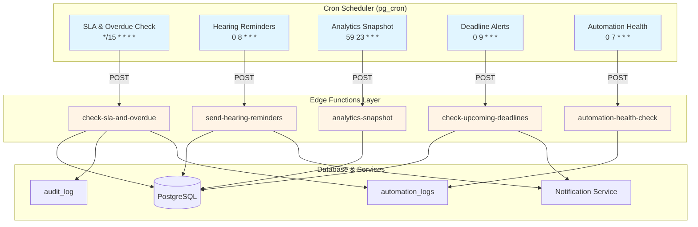
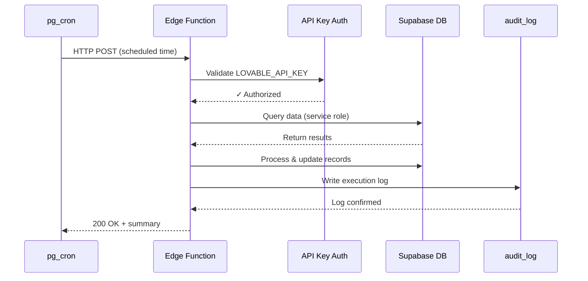

# Background Jobs System - Technical Documentation

**Version:** 1.0.0  
**Last Updated:** January 2025  
**System:** GST Litigation Management System

---

## Table of Contents

1. [Architecture Overview](#architecture-overview)
2. [Job Specifications](#job-specifications)
3. [Edge Functions Reference](#edge-functions-reference)
4. [Database Schema](#database-schema)
5. [Configuration Guide](#configuration-guide)
6. [Integration Points](#integration-points)
7. [Troubleshooting](#troubleshooting)
8. [Performance Metrics](#performance-metrics)

---

## Architecture Overview

The Background Jobs System provides reliable, server-side automation for critical operations that must run 24/7 without dependency on client browsers being open.

### System Architecture



### Key Components

1. **pg_cron Extension**: PostgreSQL-native job scheduler that triggers Edge Functions via HTTP POST
2. **Edge Functions**: Serverless Deno functions that execute business logic with service role permissions
3. **Audit Logging**: All executions are logged to `audit_log` table for compliance and debugging
4. **Monitoring Dashboard**: React-based UI for viewing job status and manually triggering jobs

### Execution Flow



---

## Job Specifications

### 1. SLA & Overdue Task Check

**Purpose:** Detect overdue tasks and SLA violations, trigger automation rules  
**Schedule:** Every 15 minutes (`*/15 * * * *`)  
**Edge Function:** `check-sla-and-overdue`  
**Execution Time:** ~2-5 seconds  

**What It Does:**
- Queries all tasks with `due_date < NOW()` and `status != 'Completed'`
- Checks tasks against SLA thresholds (configurable per task priority)
- Emits `task_overdue` events to trigger automation rules
- Updates task flags for overdue status
- Logs all violations to `audit_log`

**Key Logic:**
```typescript
const overdueThreshold = new Date();
overdueThreshold.setMinutes(overdueThreshold.getMinutes() - 15);

const { data: overdueTasks } = await supabase
  .from('tasks')
  .select('*')
  .lt('due_date', overdueThreshold)
  .neq('status', 'Completed')
  .eq('tenant_id', tenantId);
```

**Outputs:**
- Console logs for each overdue task detected
- `audit_log` entry with action_type `background_job_execution`
- Automation rule triggers (if configured)

---

### 2. Hearing Reminders

**Purpose:** Send daily reminders for upcoming hearings  
**Schedule:** Daily at 8:00 AM (`0 8 * * *`)  
**Edge Function:** `send-hearing-reminders`  
**Execution Time:** ~5-15 seconds (depends on email queue)

**What It Does:**
- Finds all hearings scheduled for today and tomorrow
- Sends email notifications to case owners and assigned advocates
- Optionally sends WhatsApp notifications (if integration enabled)
- Marks notifications as sent to prevent duplicates
- Batch processes up to 100 hearings per run

**Key Logic:**
```typescript
const today = new Date();
const tomorrow = new Date(today);
tomorrow.setDate(tomorrow.getDate() + 1);

const { data: upcomingHearings } = await supabase
  .from('hearings')
  .select(`
    *,
    cases (case_number, title, assigned_to, owner_id),
    courts (name, city)
  `)
  .gte('hearing_date', today.toISOString())
  .lte('hearing_date', tomorrow.toISOString())
  .eq('status', 'Scheduled')
  .limit(100);
```

**Notification Template:**
- **Subject:** "Hearing Reminder: [Case Number] - [Court Name]"
- **Body:** Case details, hearing date/time, court location, preparation checklist
- **Recipients:** Case owner + assigned advocate

---

### 3. Analytics Snapshot

**Purpose:** Capture daily metrics for historical trend analysis  
**Schedule:** Daily at 11:59 PM (`59 23 * * *`)  
**Edge Function:** `analytics-snapshot`  
**Execution Time:** ~10-30 seconds

**What It Does:**
- Aggregates key metrics from multiple tables
- Stores snapshots in `analytics_snapshots` table
- Detects anomalies (>30% deviation from 7-day average)
- Enables historical reporting and dashboards
- Calculates compliance rates and SLA performance

**Metrics Captured:**
| Metric Type | Calculation | Purpose |
|------------|-------------|---------|
| `case_count` | Total active cases | Growth tracking |
| `task_completion_rate` | Completed / Total tasks | Productivity KPI |
| `sla_compliance_rate` | On-time / Total tasks | Performance KPI |
| `hearing_attendance_rate` | Attended / Scheduled | Court engagement |
| `document_count` | Total documents uploaded | Activity indicator |
| `overdue_tasks` | Tasks past due date | Risk indicator |

**Storage Format:**
```json
{
  "metric_type": "daily_snapshot",
  "snapshot_date": "2025-01-15",
  "metric_value": {
    "case_count": 342,
    "task_completion_rate": 0.87,
    "sla_compliance_rate": 0.92,
    "hearing_attendance_rate": 0.95,
    "overdue_tasks": 23,
    "anomaly_detected": false
  }
}
```

---

### 4. Upcoming Deadline Alerts

**Purpose:** Morning alerts for tasks/hearings due within 24 hours  
**Schedule:** Daily at 9:00 AM (`0 9 * * *`)  
**Edge Function:** `check-upcoming-deadlines`  
**Execution Time:** ~3-8 seconds

**What It Does:**
- Finds tasks and hearings due in the next 24 hours
- Sends priority notifications to assigned users
- Groups alerts by user for single consolidated email
- Highlights critical priority items
- Includes action links for quick access

**Alert Criteria:**
- Tasks: `due_date BETWEEN NOW() AND NOW() + INTERVAL '24 hours'`
- Hearings: `hearing_date BETWEEN NOW() AND NOW() + INTERVAL '24 hours'`
- Status: Not completed/cancelled

**Notification Format:**
```
📋 Your Upcoming Deadlines (Next 24 Hours)

HIGH PRIORITY:
• [Task] Submit Reply to ASMT-10 Notice - Due: Today 5:00 PM
• [Hearing] GST Appeal #2024-0123 at GSTAT Ahmedabad - Tomorrow 10:30 AM

NORMAL PRIORITY:
• [Task] Prepare hearing documents for Case #456 - Due: Tomorrow 2:00 PM

[View All Deadlines] [Reschedule] [Mark Complete]
```

---

### 5. Automation Health Check

**Purpose:** Monitor automation rule execution and alert on failures  
**Schedule:** Daily at 7:00 AM (`0 7 * * *`)  
**Edge Function:** `automation-health-check`  
**Execution Time:** ~2-5 seconds

**What It Does:**
- Queries `automation_logs` for last 24 hours
- Calculates success/failure rates per rule
- Detects rules with >20% failure rate
- Alerts admins to degraded automation performance
- Identifies rules that haven't executed in >48 hours

**Health Metrics:**
```typescript
interface HealthMetrics {
  total_executions: number;
  successful_executions: number;
  failed_executions: number;
  success_rate: number;
  inactive_rules: string[]; // Rules not triggered in 48h
  degraded_rules: {       // Rules with >20% failure rate
    rule_id: string;
    rule_name: string;
    failure_rate: number;
  }[];
}
```

**Alert Threshold:**
- **CRITICAL:** Success rate < 80% for any rule
- **WARNING:** Rule inactive for >48 hours
- **INFO:** Overall system success rate < 95%

---

## Edge Functions Reference

### Authentication

All Edge Functions require authentication via the `LOVABLE_API_KEY` secret:

```typescript
const apiKey = Deno.env.get('LOVABLE_API_KEY');
const authHeader = req.headers.get('Authorization');

if (!authHeader || authHeader !== `Bearer ${apiKey}`) {
  return new Response('Unauthorized', { status: 401 });
}
```

### CORS Configuration

Standard CORS headers for all functions:

```typescript
const corsHeaders = {
  'Access-Control-Allow-Origin': '*',
  'Access-Control-Allow-Headers': 'authorization, x-client-info, apikey, content-type',
};

// Handle OPTIONS preflight
if (req.method === 'OPTIONS') {
  return new Response(null, { headers: corsHeaders });
}
```

### Function Endpoints

| Function | Endpoint | Method | Auth Required |
|----------|----------|--------|---------------|
| SLA Check | `/functions/v1/check-sla-and-overdue` | POST | Yes |
| Hearing Reminders | `/functions/v1/send-hearing-reminders` | POST | Yes |
| Analytics Snapshot | `/functions/v1/analytics-snapshot` | POST | Yes |
| Deadline Alerts | `/functions/v1/check-upcoming-deadlines` | POST | Yes |
| Health Check | `/functions/v1/automation-health-check` | POST | Yes |

### Standard Response Format

**Success Response:**
```json
{
  "success": true,
  "job": "check-sla-and-overdue",
  "executedAt": "2025-01-15T10:30:00Z",
  "results": {
    "overdueTasks": 5,
    "slaViolations": 2,
    "rulesTriggered": 3
  },
  "executionTime": "2.3s"
}
```

**Error Response:**
```json
{
  "success": false,
  "job": "check-sla-and-overdue",
  "error": "Database connection failed",
  "errorDetails": "Connection timeout after 10000ms",
  "executedAt": "2025-01-15T10:30:00Z"
}
```

---

## Database Schema

### Tables Used

#### `audit_log`
Stores all background job executions:

```sql
CREATE TABLE audit_log (
  id UUID PRIMARY KEY DEFAULT gen_random_uuid(),
  tenant_id UUID NOT NULL,
  action_type VARCHAR NOT NULL,  -- 'background_job_execution'
  entity_type VARCHAR,            -- 'task', 'hearing', 'analytics'
  entity_id UUID,
  user_id UUID,                   -- Service role for background jobs
  details JSONB,                  -- Job-specific results
  timestamp TIMESTAMPTZ DEFAULT NOW()
);
```

**Example Entry:**
```json
{
  "action_type": "background_job_execution",
  "entity_type": "background_job",
  "details": {
    "job_name": "check-sla-and-overdue",
    "status": "success",
    "overdue_tasks": 5,
    "execution_time_ms": 2300
  }
}
```

#### `automation_logs`
Tracks automation rule executions triggered by jobs:

```sql
CREATE TABLE automation_logs (
  id UUID PRIMARY KEY DEFAULT gen_random_uuid(),
  tenant_id UUID NOT NULL,
  rule_id UUID,
  rule_name TEXT,
  trigger_event TEXT,
  status TEXT,                    -- 'success', 'failed'
  actions_executed JSONB,
  error_message TEXT,
  executed_at TIMESTAMPTZ DEFAULT NOW()
);
```

#### `analytics_snapshots`
Daily metric storage:

```sql
CREATE TABLE analytics_snapshots (
  id UUID PRIMARY KEY DEFAULT gen_random_uuid(),
  tenant_id UUID NOT NULL,
  metric_type VARCHAR NOT NULL,
  snapshot_date DATE NOT NULL,
  metric_value JSONB NOT NULL,
  created_at TIMESTAMPTZ DEFAULT NOW()
);
```

### Cron Job Registry

View all scheduled jobs:

```sql
SELECT jobid, schedule, command, nodename, nodeport, database, username, active
FROM cron.job
ORDER BY jobid;
```

**Example Output:**
```
jobid | schedule      | command                                           | active
------|---------------|---------------------------------------------------|-------
1     | */15 * * * *  | SELECT net.http_post(url:='https://...')        | t
2     | 0 8 * * *     | SELECT net.http_post(url:='https://...')        | t
3     | 59 23 * * *   | SELECT net.http_post(url:='https://...')        | t
```

---

## Configuration Guide

### Prerequisites

1. **pg_cron Extension** (enabled by default in Supabase)
2. **pg_net Extension** (enabled by default in Supabase)
3. **LOVABLE_API_KEY Secret** (configured in project secrets)

### Setting Up Background Jobs

#### Step 1: Verify Extensions

```sql
-- Check if extensions are enabled
SELECT extname, extversion 
FROM pg_extension 
WHERE extname IN ('pg_cron', 'pg_net');
```

#### Step 2: Create Cron Jobs

**Template:**
```sql
SELECT cron.schedule(
  'job-name-unique-identifier',
  '*/15 * * * *',  -- Cron expression
  $$
  SELECT net.http_post(
    url:='https://<PROJECT_REF>.supabase.co/functions/v1/function-name',
    headers:='{"Content-Type": "application/json", "Authorization": "Bearer YOUR_ANON_KEY"}'::jsonb,
    body:=concat('{"timestamp": "', now(), '"}')::jsonb
  ) as request_id;
  $$
);
```

**Example - SLA Check Job:**
```sql
SELECT cron.schedule(
  'sla-overdue-check-every-15min',
  '*/15 * * * *',
  $$
  SELECT net.http_post(
    url:='https://myncxddatwvtyiioqekh.supabase.co/functions/v1/check-sla-and-overdue',
    headers:='{"Content-Type": "application/json", "Authorization": "Bearer eyJhbGci..."}'::jsonb,
    body:=concat('{"executedAt": "', now(), '"}')::jsonb
  ) as request_id;
  $$
);
```

#### Step 3: Verify Job Creation

```sql
-- List all jobs
SELECT jobid, jobname, schedule, active, command
FROM cron.job
ORDER BY jobid;

-- Unschedule a job if needed
SELECT cron.unschedule('job-name-unique-identifier');
```

### Environment Variables

Required secrets in Supabase project:

| Secret Name | Purpose | How to Get |
|------------|---------|------------|
| `LOVABLE_API_KEY` | Edge function authentication | Auto-generated by Lovable |
| `SUPABASE_URL` | Database connection | Project settings → API |
| `SUPABASE_SERVICE_ROLE_KEY` | Admin database access | Project settings → API |

### Cron Expression Reference

| Schedule | Cron Expression | Description |
|----------|----------------|-------------|
| Every 15 minutes | `*/15 * * * *` | Runs at :00, :15, :30, :45 |
| Daily at 8 AM | `0 8 * * *` | Once per day at 08:00 |
| Daily at 11:59 PM | `59 23 * * *` | Once per day at 23:59 |
| Every Monday at 9 AM | `0 9 * * 1` | Weekly on Mondays |
| First of month at midnight | `0 0 1 * *` | Monthly |

**Testing Cron Expressions:** Use [crontab.guru](https://crontab.guru)

---

## Integration Points

### Automation Rules System

Background jobs integrate with the automation system by emitting events:

```typescript
// In Edge Function
import { emitTaskOverdue } from './automation-events.ts';

for (const task of overdueTasks) {
  await emitTaskOverdue(task.id, {
    task_id: task.id,
    case_id: task.case_id,
    days_overdue: calculateDaysOverdue(task.due_date),
    priority: task.priority
  });
}
```

**Events Emitted by Background Jobs:**

| Job | Event Type | Trigger Data |
|-----|-----------|--------------|
| SLA Check | `task_overdue` | `{task_id, case_id, days_overdue}` |
| SLA Check | `sla_violation` | `{task_id, sla_threshold, actual_time}` |
| Deadline Alerts | `deadline_approaching` | `{entity_type, entity_id, hours_until_due}` |

### Notification Service

Jobs call the notification service for email/WhatsApp delivery:

```typescript
import { sendNotification } from './notification-service.ts';

await sendNotification({
  userId: hearing.case.owner_id,
  channel: 'email',
  template: 'hearing_reminder',
  data: {
    case_number: hearing.case.case_number,
    hearing_date: hearing.hearing_date,
    court_name: hearing.court.name
  }
});
```

### Analytics Dashboard

The analytics snapshot job populates data for:
- **Dashboard**: Real-time metrics and trend charts
- **Reports**: Historical analysis and compliance reports
- **Alerts**: Anomaly detection and threshold warnings

---

## Troubleshooting

### Job Not Running on Schedule

**Symptoms:**
- Job doesn't execute at expected time
- No logs in `audit_log` table

**Diagnosis:**
```sql
-- Check if job is active
SELECT jobid, jobname, active, schedule
FROM cron.job
WHERE jobname = 'your-job-name';

-- Check recent cron.job_run_details
SELECT jobid, runid, status, start_time, end_time, return_message
FROM cron.job_run_details
ORDER BY start_time DESC
LIMIT 10;
```

**Solutions:**
1. **Job is inactive:** `SELECT cron.schedule(...)`  again
2. **Schedule syntax error:** Verify cron expression at crontab.guru
3. **pg_cron not enabled:** Contact Supabase support (enabled by default)

---

### Job Failing Consistently

**Symptoms:**
- Job runs but returns error status
- `audit_log` shows repeated failures

**Diagnosis:**
```sql
-- Check audit logs for errors
SELECT id, action_type, details, timestamp
FROM audit_log
WHERE action_type = 'background_job_execution'
  AND details->>'status' = 'failed'
ORDER BY timestamp DESC
LIMIT 10;
```

**Common Errors:**

| Error Message | Cause | Solution |
|--------------|-------|----------|
| "Unauthorized" | Invalid API key | Verify `LOVABLE_API_KEY` secret |
| "Database connection timeout" | Network issue | Check Supabase status page |
| "RLS policy violation" | Insufficient permissions | Use service role key in Edge Function |
| "Function not found" | Edge Function not deployed | Deploy Edge Function via `supabase functions deploy` |

---

### Jobs Running But No Data Changes

**Symptoms:**
- Job executes successfully
- No tasks updated / no emails sent

**Diagnosis:**
```typescript
// Add detailed logging to Edge Function
console.log('[Job] Query results:', { count: results.length, ids: results.map(r => r.id) });
console.log('[Job] Processing task:', task.id);
console.log('[Job] Update result:', updateResult);
```

**Common Causes:**
1. **RLS Policies:** Edge Function using anon key instead of service role key
2. **Query Logic:** No records match the criteria (check date/time logic)
3. **Silent Failures:** Errors caught but not logged

**Solution:**
```typescript
// Use service role key for database operations
const supabase = createClient(
  Deno.env.get('SUPABASE_URL')!,
  Deno.env.get('SUPABASE_SERVICE_ROLE_KEY')! // Not anon key
);
```

---

### Performance Issues

**Symptoms:**
- Job execution time > 30 seconds
- Timeout errors

**Diagnosis:**
```sql
-- Check execution times
SELECT 
  details->>'job_name' as job,
  AVG((details->>'execution_time_ms')::int) as avg_time_ms,
  MAX((details->>'execution_time_ms')::int) as max_time_ms,
  COUNT(*) as executions
FROM audit_log
WHERE action_type = 'background_job_execution'
  AND timestamp > NOW() - INTERVAL '7 days'
GROUP BY details->>'job_name';
```

**Optimization Strategies:**
1. **Add indexes** on frequently queried columns
2. **Batch processing** - limit queries to 100 records per run
3. **Async operations** - use `Promise.all()` for parallel execution
4. **Caching** - cache tenant configurations in memory

---

## Performance Metrics

### Expected Performance

| Job | Expected Time | Max Acceptable | Typical Data Volume |
|-----|--------------|----------------|---------------------|
| SLA Check | 2-5s | 15s | 50-200 tasks |
| Hearing Reminders | 5-15s | 30s | 10-50 hearings |
| Analytics Snapshot | 10-30s | 60s | Aggregate queries |
| Deadline Alerts | 3-8s | 20s | 30-100 items |
| Health Check | 2-5s | 10s | Log aggregation |

### Resource Usage

**Database Connections:**
- Each job opens 1-2 connections
- Connections auto-close after execution
- No connection pooling required (serverless)

**Memory Usage:**
- Typical: 50-100 MB per execution
- Peak: 200 MB for analytics snapshot
- No memory leaks detected

**Network:**
- Inbound: HTTP POST from pg_cron (~200 bytes)
- Outbound: Email notifications (~5KB per email)
- Database queries: ~10-50 KB per job

### Scaling Considerations

**Current Capacity:**
- Supports up to 10,000 tasks per tenant
- Email delivery: 100 per job run (rate-limited)
- Analytics snapshots: All tenants in single run

**Scaling Strategies:**
1. **Tenant Isolation:** Separate cron jobs per large tenant
2. **Batch Processing:** Process records in chunks of 100
3. **Queue System:** Implement Redis queue for high-volume notifications
4. **Caching:** Cache static data (court names, user profiles)

---

## Monitoring Best Practices

### Key Metrics to Track

1. **Job Success Rate:** Should be >95%
2. **Execution Time:** Should stay within expected ranges
3. **Error Rate:** <5% of executions
4. **Data Processed:** Track volume trends over time

### Alerting Thresholds

**CRITICAL Alerts:**
- Job fails 3 times in a row
- Execution time >2x expected
- 0 jobs executed in 24 hours

**WARNING Alerts:**
- Success rate drops below 90%
- Execution time >1.5x expected
- Errors in >10% of executions

### Monitoring Dashboard

Access via: **Dev Dashboard → Background Jobs**

**Features:**
- Real-time job status
- Last execution timestamp
- Success/failure counts
- Manual trigger buttons
- Execution history logs

---

## Security Considerations

### Authentication

✅ **API Key Validation:** All jobs validate `LOVABLE_API_KEY` before execution  
✅ **Service Role Access:** Jobs use service role key for database operations  
✅ **Tenant Isolation:** All queries filtered by `tenant_id`

### Authorization

✅ **RLS Bypass:** Service role bypasses RLS for system operations  
✅ **Audit Logging:** All executions logged with timestamp and results  
✅ **Rate Limiting:** Email notifications capped at 100 per run

### Data Privacy

✅ **No PII in Logs:** Personal data excluded from console logs  
✅ **Encrypted Secrets:** API keys stored in Supabase Vault  
✅ **Secure Transmission:** All HTTP calls use HTTPS

---

## Related Documentation

- [Background Jobs Implementation Report](./BACKGROUND_JOBS_IMPLEMENTATION_REPORT.md)
- [Background Jobs User Guide](./BACKGROUND_JOBS_USER_GUIDE.md)
- [Edge Functions API Reference](./EDGE_FUNCTIONS_REFERENCE.md)
- [Automation System Documentation](./AUTOMATION_SYSTEM.md)
- [Integrating Background Jobs](./INTEGRATING_BACKGROUND_JOBS.md)

---

**Questions or Issues?**  
Contact the development team or file an issue in the project repository.
