# Background Jobs System Documentation

**Version:** 1.0.0 | **Last Updated:** January 15, 2025

Welcome to the comprehensive documentation for the Background Jobs System. This documentation package covers server-side automation, monitoring, operations, and integration for the GST Litigation Management System.

---

## 📚 Quick Navigation

| Document | Audience | Purpose | Link |
|----------|----------|---------|------|
| System Documentation | Developers, Architects | Technical reference and architecture | [View →](./BACKGROUND_JOBS_SYSTEM.md) |
| Implementation Report | Stakeholders, QA | Phase 3 delivery and success metrics | [View →](./BACKGROUND_JOBS_IMPLEMENTATION_REPORT.md) |
| User Guide | Admins, Partners | Using the monitoring dashboard | [View →](./BACKGROUND_JOBS_USER_GUIDE.md) |
| Operations Guide | DevOps, Admins | Monitoring and troubleshooting | [View →](./BACKGROUND_JOBS_OPERATIONS.md) |
| Quick Reference | All Users | Commands and common tasks | [View →](./BACKGROUND_JOBS_QUICK_REFERENCE.md) |
| Release Notes | All Users | Version history and changes | [View →](./BACKGROUND_JOBS_RELEASE_NOTES.md) |
| Integration Guide | Developers | Creating new background jobs | [View →](./INTEGRATING_BACKGROUND_JOBS.md) |
| API Reference | Developers | Edge Functions endpoints | [View →](./EDGE_FUNCTIONS_REFERENCE.md) |
| Inline Help | End Users | In-app contextual help | [View →](../public/help/inline/background-jobs.json) |

---

## 🎯 Documentation by Audience

### For Users & Administrators
- **[User Guide](./BACKGROUND_JOBS_USER_GUIDE.md)** - Complete guide to monitoring and managing background jobs
- **[Quick Reference](./BACKGROUND_JOBS_QUICK_REFERENCE.md)** - One-page cheat sheet for common tasks
- **[Operations Guide](./BACKGROUND_JOBS_OPERATIONS.md)** - Operational procedures and troubleshooting

### For Developers
- **[System Documentation](./BACKGROUND_JOBS_SYSTEM.md)** - Architecture, design, and technical details
- **[Integration Guide](./INTEGRATING_BACKGROUND_JOBS.md)** - How to create and deploy new jobs
- **[API Reference](./EDGE_FUNCTIONS_REFERENCE.md)** - Complete Edge Functions API documentation

### For Stakeholders
- **[Implementation Report](./BACKGROUND_JOBS_IMPLEMENTATION_REPORT.md)** - Delivery report with metrics
- **[Release Notes](./BACKGROUND_JOBS_RELEASE_NOTES.md)** - Version history and roadmap

---

## 📖 Detailed Document Descriptions

### 1. [Background Jobs System Documentation](./BACKGROUND_JOBS_SYSTEM.md)
**Target Audience:** Developers, System Architects  
**Reading Time:** ~40 minutes  
**Word Count:** ~4,000 words

**Description:** The main technical reference covering the complete background jobs architecture, including pg_cron integration, Edge Functions, database schemas, and system design patterns. This document is essential for understanding how the background jobs system works under the hood.

**Key Sections:**
- System architecture with Mermaid diagrams
- Detailed specifications for all 5 background jobs
- Database schema and table relationships
- Edge Functions integration patterns
- Configuration and deployment guide
- Performance optimization and scaling
- Security model and authentication
- Comprehensive troubleshooting guide

**When to Use:** 
- Onboarding new developers to the system
- Understanding the technical implementation
- Debugging complex issues
- Planning system enhancements

---

### 2. [Implementation Report](./BACKGROUND_JOBS_IMPLEMENTATION_REPORT.md)
**Target Audience:** Project Managers, QA, Stakeholders  
**Reading Time:** ~25 minutes  
**Word Count:** ~2,500 words

**Description:** A comprehensive delivery report documenting the Phase 3 implementation of server-side background jobs. Includes before/after comparisons, success metrics (60% → 95% reliability improvement), and a complete inventory of files created/modified.

**Key Sections:**
- Executive summary with business impact
- Complete list of deliverables
- Before/after architecture comparison
- Testing results and validation
- Performance metrics and KPIs
- Known limitations
- Lessons learned
- Stakeholder sign-off section

**When to Use:**
- Reviewing project completion status
- Understanding business value delivered
- QA validation and testing reference
- Historical documentation for future projects

---

### 3. [User Guide](./BACKGROUND_JOBS_USER_GUIDE.md)
**Target Audience:** System Administrators, Partners  
**Reading Time:** ~30 minutes  
**Word Count:** ~3,000 words

**Description:** End-user guide for accessing and using the Background Jobs Monitor dashboard. Covers monitoring job status, reading execution logs, manual job triggers, and common operational scenarios.

**Key Sections:**
- Quick start guide
- Dashboard navigation and components
- Understanding job status indicators
- Reading and interpreting logs
- Manual job trigger procedures
- Common scenarios and solutions
- Best practices for daily monitoring
- FAQ section

**When to Use:**
- First-time users learning the monitoring dashboard
- Daily monitoring and health checks
- Manually triggering jobs in emergencies
- Understanding job execution patterns

---

### 4. [Operations Guide](./BACKGROUND_JOBS_OPERATIONS.md)
**Target Audience:** DevOps Engineers, System Administrators  
**Reading Time:** ~20 minutes  
**Word Count:** ~2,000 words

**Description:** Operational runbook for monitoring system health, diagnosing issues, and performing administrative tasks. Includes step-by-step troubleshooting workflows and escalation procedures.

**Key Sections:**
- System health monitoring procedures
- Job status interpretation
- Troubleshooting decision trees
- Performance monitoring and metrics
- Security validation procedures
- Backup and recovery guidelines
- Escalation procedures
- Incident response workflows

**When to Use:**
- Daily operational health checks
- Troubleshooting job failures
- Performance degradation investigation
- Security audits
- Incident response

---

### 5. [Quick Reference Card](./BACKGROUND_JOBS_QUICK_REFERENCE.md)
**Target Audience:** All Users  
**Reading Time:** ~5 minutes  
**Word Count:** ~500 words

**Description:** One-page cheat sheet with job schedules, common SQL commands, troubleshooting quick checks, and key metrics. Designed for printing or quick reference during operations.

**Key Sections:**
- Job schedule table with cron expressions
- Common SQL commands (query jobs, check history, manual triggers)
- Top 5 troubleshooting quick checks
- Key health metrics dashboard
- Emergency contact information

**When to Use:**
- Quick command reference during operations
- Troubleshooting common issues
- Checking job schedules
- Emergency situations requiring fast access to info

---

### 6. [Release Notes](./BACKGROUND_JOBS_RELEASE_NOTES.md)
**Target Audience:** All Users  
**Reading Time:** ~8 minutes  
**Word Count:** ~800 words

**Description:** Version history, changelog, and roadmap for the Background Jobs System. Documents what changed in v1.0.0, migration from client-side scheduler, and future planned features.

**Key Sections:**
- v1.0.0 initial release details
- Migration from client-side to server-side
- Breaking changes (none)
- New features and capabilities
- Performance improvements
- Known issues and limitations
- Future roadmap (v1.1.0, v2.0.0)
- Upgrade instructions

**When to Use:**
- Understanding what's new in current version
- Planning for future releases
- Checking known limitations
- Upgrade planning

---

### 7. [Developer Integration Guide](./INTEGRATING_BACKGROUND_JOBS.md)
**Target Audience:** Backend Developers  
**Reading Time:** ~25 minutes  
**Word Count:** ~2,500 words

**Description:** Complete guide for developers creating new background jobs, including Edge Function templates, cron job setup, best practices for idempotency and error handling, and testing strategies.

**Key Sections:**
- Creating new Edge Functions (step-by-step)
- Deploying Edge Functions via Supabase CLI
- Configuring cron jobs with pg_cron
- Idempotency patterns and examples
- Error handling best practices
- Batch processing patterns
- Testing Edge Functions (local and production)
- Registering jobs in monitoring UI

**When to Use:**
- Creating new background jobs
- Extending existing job functionality
- Learning best practices for serverless functions
- Debugging job execution issues

---

### 8. [Edge Functions API Reference](./EDGE_FUNCTIONS_REFERENCE.md)
**Target Audience:** Developers, Integration Partners  
**Reading Time:** ~30 minutes  
**Word Count:** ~3,000 words

**Description:** Complete API reference for all 5 Edge Functions used by background jobs. Includes authentication, endpoints, request/response formats, error codes, and testing examples.

**Key Sections:**
- Authentication with LOVABLE_API_KEY
- Function-by-function reference:
  - `check-sla-and-overdue`
  - `send-hearing-reminders`
  - `analytics-snapshot`
  - `check-upcoming-deadlines`
  - `automation-health-check`
- Request/response schemas
- Error handling and status codes
- Testing with curl and Supabase tools

**When to Use:**
- Integrating with Edge Functions
- Understanding API contracts
- Debugging API calls
- Testing Edge Functions manually

---

### 9. [Inline Help Entries](../public/help/inline/background-jobs.json)
**Target Audience:** End Users  
**Format:** JSON

**Description:** Contextual help tooltips that appear in the Background Jobs Monitor UI. Provides quick explanations for each job, status indicators, and UI actions.

**Contents:**
- Job-specific help entries (8 entries)
- UI component tooltips
- Links to detailed documentation
- Quick tips for common operations

**When to Use:**
- Integrated automatically in the UI
- Reference for developers adding new help tooltips
- Understanding in-app help structure

---

## 🗺️ Documentation Navigation Map

```mermaid
graph TB
    Start[📚 Start Here] --> Role{Your Role?}
    
    Role -->|👤 Admin/User| UG[📖 User Guide]
    Role -->|👨‍💻 Developer| SYS[🔧 System Docs]
    Role -->|⚙️ DevOps| OPS[🛠️ Operations Guide]
    Role -->|📊 Stakeholder| IMPL[📋 Implementation Report]
    
    UG --> QR[⚡ Quick Reference]
    SYS --> INT[🔌 Integration Guide]
    SYS --> API[📡 API Reference]
    OPS --> QR
    
    QR --> Detail{Need More?}
    Detail -->|Technical Details| SYS
    Detail -->|History| REL[📅 Release Notes]
    Detail -->|Troubleshooting| OPS
    
    INT --> API
    API --> Test[🧪 Testing]
    
    style Start fill:#e1f5ff
    style UG fill:#fff4e6
    style SYS fill:#f3e5f5
    style OPS fill:#e8f5e9
    style IMPL fill:#fce4ec
```

---

## 🚀 Getting Started

### New to Background Jobs?
1. **Start with the [User Guide](./BACKGROUND_JOBS_USER_GUIDE.md)** to understand the monitoring dashboard
2. **Reference the [Quick Reference Card](./BACKGROUND_JOBS_QUICK_REFERENCE.md)** for common commands
3. **Check the [Operations Guide](./BACKGROUND_JOBS_OPERATIONS.md)** when troubleshooting

### Building New Jobs?
1. **Read the [System Documentation](./BACKGROUND_JOBS_SYSTEM.md)** to understand architecture
2. **Follow the [Integration Guide](./INTEGRATING_BACKGROUND_JOBS.md)** for step-by-step instructions
3. **Reference the [API Documentation](./EDGE_FUNCTIONS_REFERENCE.md)** for API specs

### Managing Operations?
1. **Use the [Operations Guide](./BACKGROUND_JOBS_OPERATIONS.md)** for daily procedures
2. **Keep the [Quick Reference](./BACKGROUND_JOBS_QUICK_REFERENCE.md)** handy for common tasks
3. **Escalate issues following the [Operations Guide](./BACKGROUND_JOBS_OPERATIONS.md) procedures

---

## 📊 Document Metadata

| Document | Approx. Pages | Last Updated | Status |
|----------|---------------|--------------|--------|
| System Documentation | ~15 | 2025-01-15 | ✅ Complete |
| Implementation Report | ~10 | 2025-01-15 | ✅ Complete |
| User Guide | ~12 | 2025-01-15 | ✅ Complete |
| Operations Guide | ~8 | 2025-01-15 | ✅ Complete |
| Quick Reference | ~2 | 2025-01-15 | ✅ Complete |
| Release Notes | ~3 | 2025-01-15 | ✅ Complete |
| Integration Guide | ~10 | 2025-01-15 | ✅ Complete |
| API Reference | ~12 | 2025-01-15 | ✅ Complete |
| Inline Help | N/A | 2025-01-15 | ✅ Complete |

**Total Documentation:** ~18,300 words across 9 files

---

## 🔗 Related Resources

### In-App Access
- **Background Jobs Monitor:** Navigate to Dev Dashboard → Background Jobs tab
- **Inline Help:** Tooltips available throughout the monitoring UI

### Source Code
- **Edge Functions:** `supabase/functions/`
  - `check-sla-and-overdue/`
  - `send-hearing-reminders/`
  - `analytics-snapshot/`
  - `check-upcoming-deadlines/`
  - `automation-health-check/`
- **Database Migrations:** `supabase/migrations/20250115_create_background_jobs_cron.sql`
- **Monitoring Component:** `src/components/dev-dashboard/BackgroundJobsMonitor.tsx`

### Related Documentation
- Automation System Documentation
- Database Schema Documentation
- Notification System Documentation
- Analytics System Documentation

---

## 📞 Support & Feedback

### Reporting Issues
- **Critical Issues (P0):** Contact DevOps On-Call (15-minute response)
- **Job Failures (P1):** Backend Team (1-hour response)
- **Performance Issues (P2):** Database Team (4-hour response)
- **General Questions:** Tech Support (24-hour response)

### Documentation Feedback
If you find errors or have suggestions for improving this documentation, please:
1. Note the document name and section
2. Describe the issue or suggestion
3. Submit feedback to the documentation team

---

## 📝 Document Conventions

- **💡 Tip:** Helpful suggestions and best practices
- **⚠️ Warning:** Important cautions and potential issues
- **🔒 Security:** Security-related information
- **🚀 Performance:** Performance optimization tips
- **📊 Metrics:** Key performance indicators
- **🐛 Debug:** Debugging and troubleshooting info

---

**Last Updated:** January 15, 2025  
**Documentation Version:** 1.0.0  
**System Version:** Background Jobs v1.0.0
